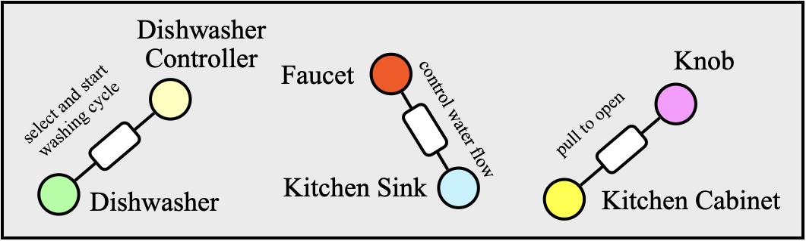

# Open-Vocabulary Functional 3D Scene Graphs for Real-World Indoor Spaces

[**Project Page**](https://openfungraph.github.io/)




## Setup

### Install the required libraries

```bash
conda create -n openfungraph python=3.10
conda activate openfungraph

##### Install Pytorch according to your own setup #####
# For example, if you have a GPU with CUDA 11.8
# Note that this version is compatible with the LLaVA repo
# Here we install cudatoolkit via Conda for installation of Grounded-SAM
# 오타 주의. cudatoolkit=11.8 아니라 cuda-toolkit=11.8 설치해야함
conda install pytorch==2.1.2 torchvision==0.16.2 torchaudio==2.1.2 pytorch-cuda=11.8 cuda-toolkit=11.8 -c pytorch -c nvidia

# Install the Faiss library (CPU version should be fine)
conda install -c pytorch faiss-cpu=1.7.4 mkl=2021 blas=1.0=mkl

# Install Pytorch3D by 
# https://github.com/facebookresearch/pytorch3d/blob/main/INSTALL.md 대신 아래 명령어 사용
# conda install pytorch3d -c pytorch3d # 잘 설치 안됨. 아래 명령어 사용
conda install -c conda-forge fvcore iopath 
git clone https://github.com/facebookresearch/pytorch3d.git
cd pytorch3d
python -m pip install -e . --no-deps --no-build-isolation --no-use-pep517 --config-settings editable_mode=compat
# We recommend installing from a local clone to avoid confliction

# Install the required libraries
pip install tyro open_clip_torch wandb h5py openai hydra-core distinctipy pyviz3d line_profiler

# 추가로 버전 일치 
conda install nvidia/label/cuda-11.8.0::cuda-nvcc
conda install nvidia::cuda-cudart-dev

# Install the gradslam package and its dependencies
git clone https://github.com/krrish94/chamferdist.git 
cd chamferdist
pip install .
cd ..

git clone https://github.com/gradslam/gradslam.git
# requirements.txt에서 open3d 버전 0.16.0으로 수정 필요
# requirements.txt에서 chamferdist==1.0.0 주석 처리 필요
# 혹은 수정된 fork repo 이용: https://github.com/k2room/gradslam.git
cd gradslam
# git checkout conceptfusion 안해도 됨
pip install .
```

### Install [Grounded-SAM](https://github.com/IDEA-Research/Grounded-Segment-Anything) package

Follow the instructions on the original [repo](https://github.com/IDEA-Research/Grounded-Segment-Anything#install-without-docker). 

First checkout the package by 

```bash
git clone git@github.com:IDEA-Research/Grounded-Segment-Anything.git
```

Then, install the package Following the commands listed in the original GitHub repo. You can skip the `Install osx` step and the "optional dependencies". 

```bash
# 아래 명령어 수행
cd Grounded-Segment-Anything/
export AM_I_DOCKER=False
export BUILD_WITH_CUDA=True
export CUDA_HOME=/home/k2room/.conda/envs/openfungraph
python -m pip install -e segment_anything
pip install --no-build-isolation -e GroundingDINO

git clone https://github.com/xinyu1205/recognize-anything.git
pip install -r ./recognize-anything/requirements.txt
pip install -e ./recognize-anything/
```

During this process, you will need to set the `CUDA_HOME` to be where the CUDA toolkit is installed. 
The CUDA tookit can be set up system-wide or within a conda environment. 
We tested it within a conda environment, i.e. installing [cudatoolkit-dev](https://anaconda.org/conda-forge/cudatoolkit-dev)    using conda by former commands. 

```bash
# and you need to replace `export CUDA_HOME=/path/to/cuda-11.3/` by 
export CUDA_HOME=/path/to/anaconda3/envs/openfungraph/
```

You also need to download `ram_swin_large_14m.pth`, `groundingdino_swint_ogc.pth`, `sam_vit_h_4b8939.pth` following the instruction [here](https://github.com/IDEA-Research/Grounded-Segment-Anything#label-grounded-sam-with-ram-or-tag2text-for-automatic-labeling). 

After installation, set the path to Grounded-SAM as an environment variable.

```bash
export GSA_PATH=/path/to/Grounded-Segment-Anything
# => export GSA_PATH=/home/main/workspace/k2room2/Baselines/OpenFunGraph/Grounded-Segment-Anything
```

### Set up LLaVA

Follow the instructions on the [LLaVA repo](https://github.com/haotian-liu/LLaVA) to set it up. We have tested with model checkpoint `LLaVA-7B-v1.6`.

```bash
# 아래 명령어 수행
git clone https://github.com/haotian-liu/LLaVA.git
cd LLaVA
pip install -e .
```

### Install this repo

```bash
cd OpenFunGraph
pip install -e .
```

## Prepare dataset

Download the [customized SceneFun3D dataset](https://huggingface.co/datasets/OpenFunGraph/SceneFun3D_Graph) and the newly recorded [FunGraph3D dataset](https://huggingface.co/datasets/OpenFunGraph/FunGraph3D). 

In their top repo, file structure is introduced.
Note that related path should be set as ``env_vars.bash.template``.

```bash
export FUNGRAPH3D_ROOT=
export FUNGRAPH3D_CONFIG_PATH=${FG_FOLDER}/openfungraph/dataset/dataconfigs/fungraph3d/fungraph3d.yaml
export SCENEFUN3D_ROOT=  # for SceneFun3D, it should be with dev / test
export SCENEFUN3D_CONFIG_PATH=${FG_FOLDER}/openfungraph/dataset/dataconfigs/scenefun3d/scenefun3d.yaml

# 아래 명령어 이용
export FG_FOLDER=/home/main/workspace/k2room2/Baselines/OpenFunGraph/
export FUNGRAPH3D_ROOT=/home/main/workspace/k2room2/gpuserver00_storage/CAPA/FunGraph3D/
export FUNGRAPH3D_CONFIG_PATH=${FG_FOLDER}/openfungraph/dataset/dataconfigs/fungraph3d/fungraph3d.yaml
export SCENEFUN3D_ROOT=/home/main/workspace/k2room2/gpuserver00_storage/CAPA/SceneFun3D_Graph/test/
export SCENEFUN3D_CONFIG_PATH=${FG_FOLDER}/openfungraph/dataset/dataconfigs/scenefun3d/scenefun3d.yaml
```

OpenFunGraph can also be easily run on other dataset. 
See `dataset/datasets_common.py` for how to write your own dataloader. 

## Run OpenFunGraph

The env variables needed can be found in `env_vars.bash.template`. 
When following the setup guide below, you should change the variables accordingly for easy setup. 

The following commands should be run in the `openfungraph` folder.

```bash
cd openfungraph
```

### Functional Scene Graph Node Detection

```bash
export SCENE_NAME=469011/45663175/

bash scenegraph/detection_scenefun3d.sh (or *_fungraph3d.sh)
```

The above commands will save the 2D node detection and segmentation results.

You can ignore the `There's a wrong phrase happen, this is because of our post-process merged wrong tokens, which will be modified in the future. We will assign it with a random label at this time.` message. 

### 3D Functional Scene Graph Construction

Ensure that the `openai` package is installed and that your APIKEY is set. We recommend using GPT-4.
```bash
export OPENAI_API_KEY=<your GPT-4 API KEY here>
```

```bash
#  dataset_root 둘 중 하나 선택
# build_fungraph_whole_openai.py ==> build_fungraph_whole_openai_refactor.py으로 버그 수정
# https://platform.openai.com/docs/api-reference/responses/create 참고
CUDA_VISIBLE_DEVICES=0 python scenegraph/build_fungraph_whole_openai_refactor.py --dataset_root ${SCENEFUN3D_ROOT} ``or`` ${FUNGRAPH3D_ROOT}  --scene_name ${SCENE_NAME} --mapfile /home/main/workspace/k2room2/gpuserver00_storage/CAPA/SceneFun3D_Graph/test/${SCENE_NAME}pcd_saves/full_pcd_ram_withbg_allclasses_overlap_maskconf0.3_bbox0.9_simsum1.2_dbscan.1_post.pkl.gz --part_file /home/main/workspace/k2room2/gpuserver00_storage/CAPA/SceneFun3D_Graph/test/${SCENE_NAME}part/pcd_saves/full_pcd_ram_withbg_allclasses_overlap_maskconf0.15_bbox0.1_simsum1.2_dbscan.1_parts_post.pkl.gz 
```

### Visualize and Evaluation

After running the algorithm, you can get three modified key assets of object-level nodes ``<SCENE_PATH>/pcd_saves/full_pcd_ram_withbg_allclasses_overlap_maskconf0.3_bbox0.9_simsum1.2_dbscan.1_post.pkl.gz`` (the name could be varied depending on what parameters you choose), sub-object-level elements ``<SCENE_PATH>/part/pcd_saves/full_pcd_ram_withbg_allclasses_overlap_maskconf0.15_bbox0.1_simsum1.2_dbscan.1_parts_post.pkl.gz``, and the finel graph edges ``<SCENE_PATH>/cfslam_funcgraph_edges.pkl`` (or with confidence).

Visualize them by
```bash
python scripts/pyviz3d_interactable_results.py --inter_result_path <PATH TO OBJECT-LEVEL NODES> --part_result_path <PATH TO SUB-OBJECT-LEVEL ELEMENTS> --edge_file <PATH TO GRAPH EDGES> --pc_path <PATH TO SCENE POINT CLOUD> (--pose_path (only for SCENEFUN3D) <SCENE_PATH>/*_transform.npy) 
```

Evaluation scripts:
For node evaluation
```bash
python eval/eval_node.py --dataset <SceneFun3D or FunGraph3D> --root_path <PATH TO THE DATASET> --scene <SCENE NAME> --video <VIDEO NAME> (--split (only for SCENEFUN3D) <dev or test>)
# e.g, 469011/45663175/
# python eval/eval_node.py --dataset SceneFun3D --root_path /home/main/workspace/k2room2/gpuserver00_storage/CAPA/SceneFun3D_Graph --scene 469011 --video 45663175 --split test
```

You can also control the top K value for retrieval and the IoU threshold for spatial alignment by using ``--topk`` and ``--iou_threshold``. 

For triplet evaluation
```bash
python eval/eval_triplet.py --dataset <SceneFun3D or FunGraph3D> --root_path <PATH TO THE DATASET> --scene <SCENE NAME> --video <VIDEO NAME> (--split (only for SCENEFUN3D) <dev or test>)
```


# Experiments command for linux terminal
1) 환경 변수 설정. 각 터미널에서 conda 환경 실행할 때마다 수행하기.
```bash
export CUDA_HOME=/home/k2room/.conda/envs/openfungraph/
export GSA_PATH=/home/main/workspace/k2room2/Baselines/OpenFunGraph/Grounded-Segment-Anything

export FG_FOLDER=/home/main/workspace/k2room2/Baselines/OpenFunGraph/
export FUNGRAPH3D_ROOT=/home/main/workspace/k2room2/gpuserver00_storage/CAPA/FunGraph3D/
export FUNGRAPH3D_CONFIG_PATH=${FG_FOLDER}/openfungraph/dataset/dataconfigs/fungraph3d/fungraph3d.yaml
export SCENEFUN3D_ROOT=/home/main/workspace/k2room2/gpuserver00_storage/CAPA/SceneFun3D_Graph/test/
export SCENEFUN3D_CONFIG_PATH=${FG_FOLDER}/openfungraph/dataset/dataconfigs/scenefun3d/scenefun3d.yaml

export LD_LIBRARY_PATH="$CONDA_PREFIX/lib:$CONDA_PREFIX/lib64:${LD_LIBRARY_PATH}"
export CLASS_SET=ram
export THRESHOLD=1.2

# 아래는 알아서 사용
export CUDA_VISIBLE_DEVICES=2

# 아래는 단일 scene test
# export SCENE_NAME=469011/45663175/
# export SCENE_NAME=13bathroom/video0/
```
2) bash 자동화 파일 실행. 중간에 PROCESSED 리스트를 수정하여 이미 결과물 생성한 scene은 스킵할 수 있음.
```bash
# Node 
bash run_all_scenefun3d.sh
bash run_all_fungraph3d.sh

# Edge

# Eval 
```